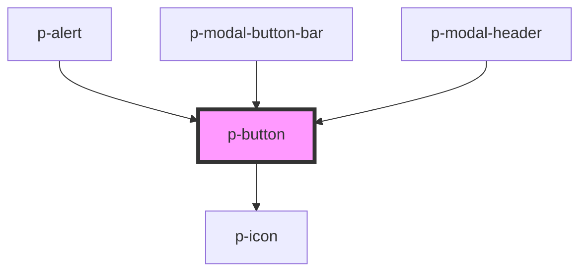

# p-button

Buttons trigger an action such as submitting a form or showing/hiding an interface component.

<!-- Auto Generated Below -->

## Overview

Buttons trigger an action such as submitting a form or showing/hiding an interface component.

## Properties

| Property     | Attribute      | Description                             | Type                                                                               | Default         |
| ------------ | -------------- | --------------------------------------- | ---------------------------------------------------------------------------------- | --------------- |
| `disabled`   | `disabled`     | disabled state of button                | `boolean`                                                                          | `false`         |
| `hasLoader`  | `has-loader`   | does the button have a loader displayed | `boolean`                                                                          | `false`         |
| `iconConfig` | --             | config for icon on button               | `IIconConfig`                                                                      | `undefined`     |
| `isIconOnly` | `is-icon-only` | is the button an icon only button       | `boolean`                                                                          | `false`         |
| `size`       | `size`         | size of button                          | `"large" \| "medium" \| "small"`                                                   | `'medium'`      |
| `text`       | `text`         | text for button                         | `string`                                                                           | `undefined`     |
| `type`       | `type`         | type of button                          | `"button" \| "reset" \| "submit"`                                                  | `'button'`      |
| `uuid`       | `uuid`         | uuid for button                         | `string`                                                                           | `undefined`     |
| `variant`    | `variant`      | variant of button                       | `"action" \| "destructive" \| "ghost" \| "naked" \| "progressive" \| "regressive"` | `'progressive'` |

## Events

| Event           | Description | Type               |
| --------------- | ----------- | ------------------ |
| `buttonClicked` |             | `CustomEvent<any>` |

## Dependencies

### Used by

 - [p-alert](../p-alert)
 - [p-modal-button-bar](../p-modal-button-bar)
 - [p-modal-header](../p-modal-header)

### Depends on

- [p-icon](../p-icon)

### Graph

----------------------------------------------

*Built with [StencilJS](https://stenciljs.com/)*
