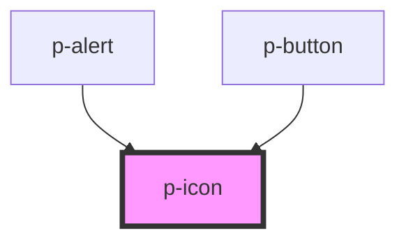

# p-icon

An icon is a graphic symbol designed to visually indicate the purpose of an interface element.

<!-- Auto Generated Below -->

## Overview

An icon is a graphic symbol designed to visually indicate the purpose of an interface element.

## Properties

| Property     | Attribute | Description               | Type          | Default     |
| ------------ | --------- | ------------------------- | ------------- | ----------- |
| `iconConfig` | --        | config for icon component | `IIconConfig` | `undefined` |

## CSS Custom Properties

| Name             | Description       |
| ---------------- | ----------------- |
| `--p-icon-color` | Color of the icon |
| `--p-icon-size`  | Size of the icon  |

## Dependencies

### Used by

 - [p-alert](../p-alert)
 - [p-button](../p-button)

### Graph

----------------------------------------------

*Built with [StencilJS](https://stenciljs.com/)*
