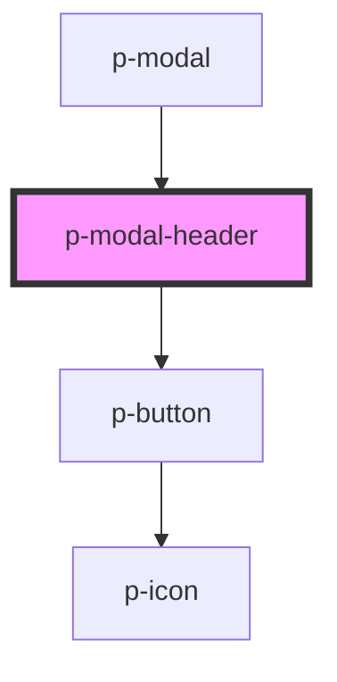

# p-modal-header

<!-- Auto Generated Below -->

## Properties

| Property               | Attribute                 | Description | Type      | Default     |
| ---------------------- | ------------------------- | ----------- | --------- | ----------- |
| `modalHeaderCloseText` | `modal-header-close-text` |             | `string`  | `undefined` |
| `modalHeaderHasClose`  | `modal-header-has-close`  |             | `boolean` | `true`      |
| `modalHeaderText`      | `modal-header-text`       |             | `string`  | `undefined` |

## Events

| Event        | Description | Type               |
| ------------ | ----------- | ------------------ |
| `closeModal` |             | `CustomEvent<any>` |

## Dependencies

### Used by

 - [p-modal](../p-modal)

### Depends on

- [p-button](../p-button)

### Graph

----------------------------------------------

*Built with [StencilJS](https://stenciljs.com/)*
